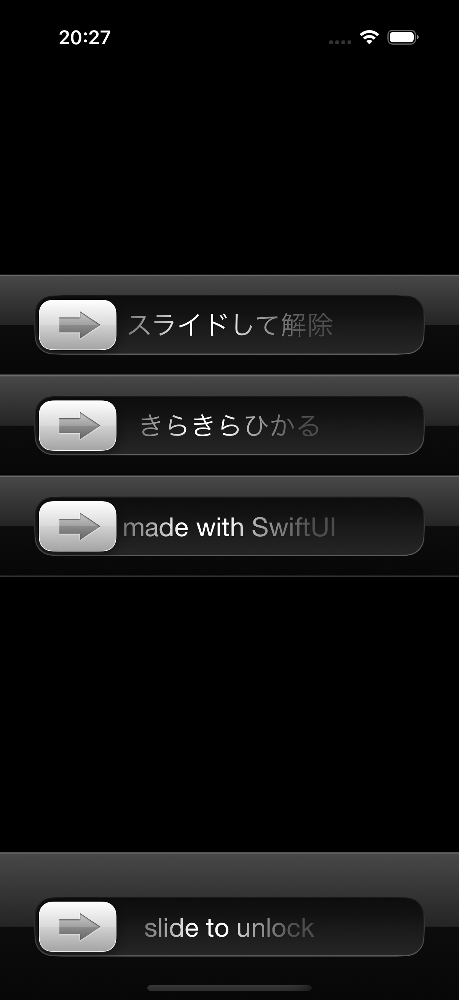
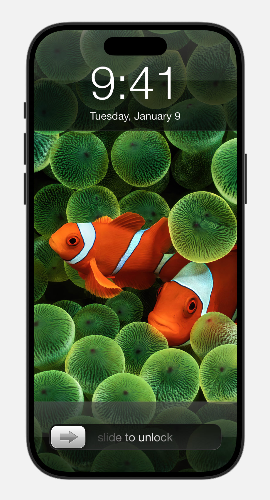

# SlideToUnlock

A replication of the “slide to unlock” UI (slider and shimmer text) that existed before iOS 6, it is completely made of SwiftUI.

This is my hobby and training project.

 

The wallpaper from:
https://www.reddit.com/r/wallpapers/comments/e7x2ty/the_old_apple_clown_fish_wallpaper_upscaled_to/