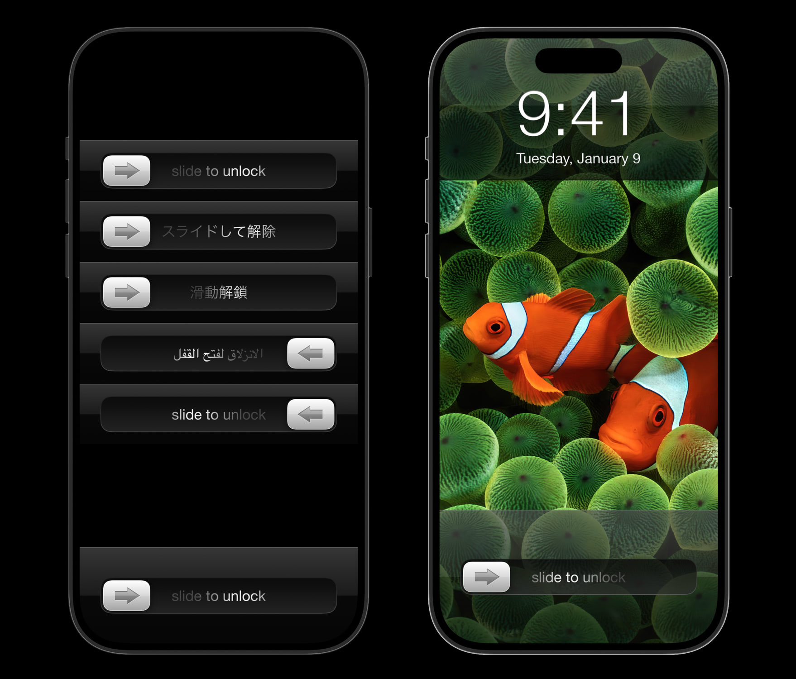

# SlideToUnlock

A replication of the “slide to unlock” UI (slider and shimmer text) that existed before iOS 6, it is completely made with SwiftUI. Remember the feel of pixel materials in those days and soak in nostalgia.

 

## Notes:

- Hobby project
- Some of the codes are hard-coded
- That wallpaper from:
https://www.reddit.com/r/wallpapers/comments/e7x2ty/the_old_apple_clown_fish_wallpaper_upscaled_to/